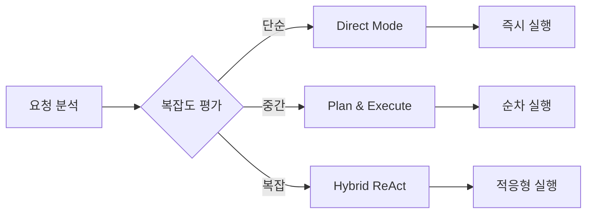
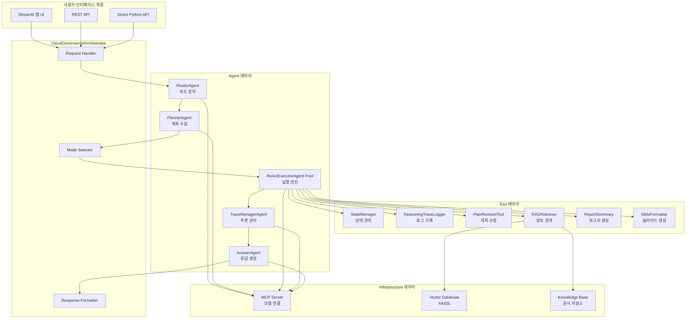
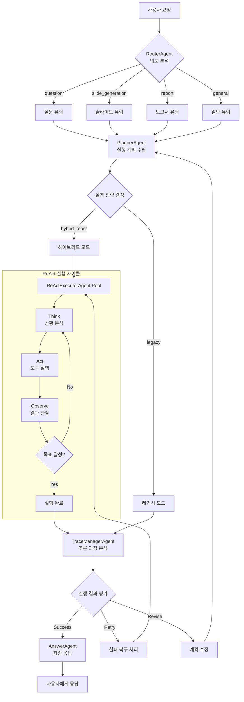
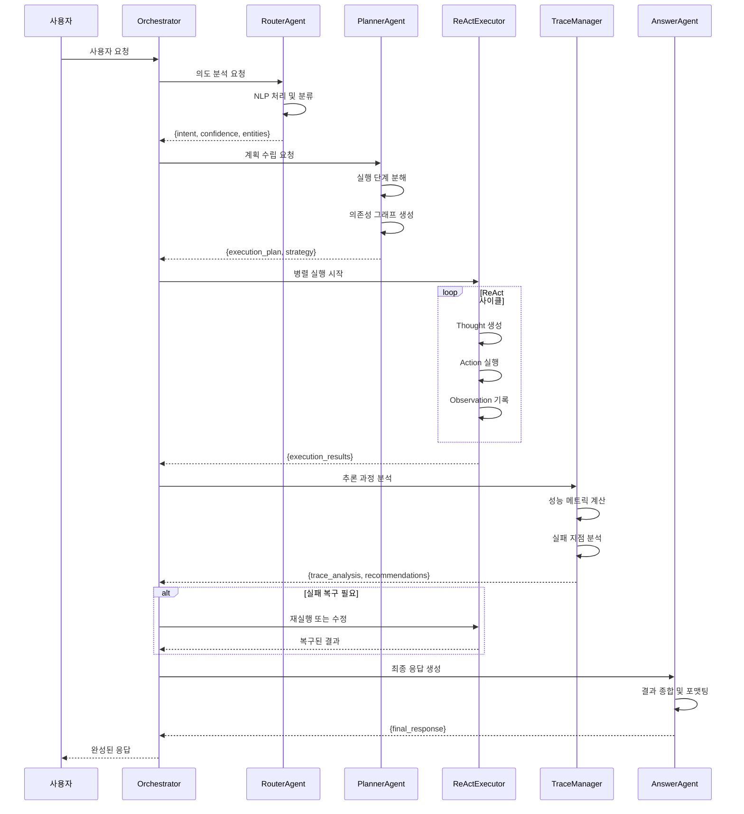
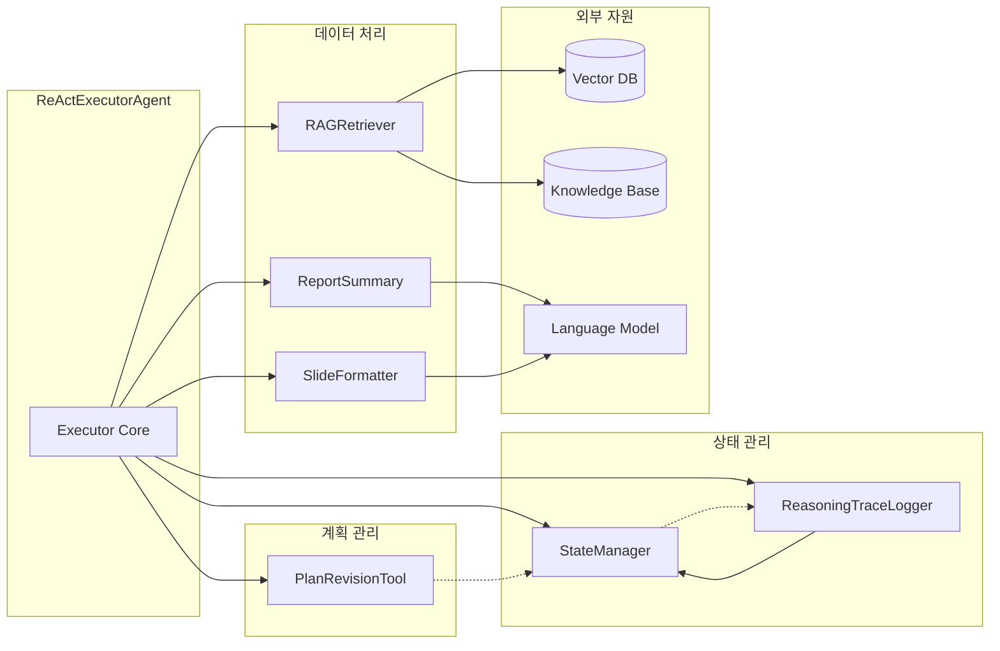
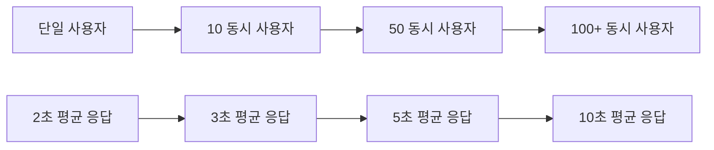

# CloudRegiX - 클라우드 거버넌스 AI 시스템


## 🌟 프로젝트 개요

**CloudRegiX**는 차세대 클라우드 거버넌스를 위한 혁신적인 하이브리드 AI 시스템입니다.

### 🎯 핵심 가치

- **지능형 자동화**: Plan & Execute와 ReAct(Reasoning and Acting) 방식을 결합한 고도화된 AI 처리
- **멀티 에이전트 협업**: 전문화된 5개 핵심 에이전트의 유기적 협력
- **실시간 적응성**: 동적 상황 변화에 대응하는 자가 학습 시스템
- **확장 가능한 아키텍처**: 모듈러 설계로 손쉬운 기능 확장

### 🚀 주요 특징

- **🔄 하이브리드 처리**: 계획 기반 실행과 추론 기반 행동의 최적 결합
- **⚡ 병렬 처리**: 최대 5개 ReAct Executor의 동시 실행
- **🛡️ 복구 메커니즘**: 실패 상황 자동 감지 및 복구
- **📊 실시간 추적**: 전 과정 추론 로그 및 성능 메트릭
- **🎨 다양한 출력**: 질문 응답, 보고서, 슬라이드 등 멀티 포맷 지원

## 📁 폴더 구조

```
CloudRegiX/
├── agents/                     # AI 에이전트 모음
│   ├── __init__.py
│   ├── router_agent.py         # 사용자 의도 분석 에이전트
│   ├── planner_agent.py        # 하이브리드 실행 계획 수립 에이전트
│   ├── answer_agent.py         # 최종 응답 생성 에이전트
│   ├── react_executor_agent.py # ReAct 방식 실행 에이전트
│   └── trace_manager_agent.py  # 추론 과정 분석 에이전트
├── core/                       # 기본 클래스 및 설정
│   ├── __init__.py
│   ├── base_agent.py          # 에이전트 기본 클래스
│   ├── base_tool.py           # 도구 기본 클래스
│   ├── settings.py            # 시스템 설정
│   └── stream_agent.py        # 스트리밍 에이전트
├── tools/                      # 시스템 도구 모음
│   ├── __init__.py
│   ├── state_manager.py       # 상태 관리 도구
│   ├── reasoning_trace_logger.py # 추론 로그 기록 도구
│   ├── plan_revision_tool.py  # 계획 수정 도구
│   ├── rag_retriever.py       # RAG 기반 정보 검색 도구
│   ├── report_summary.py      # 보고서 요약 도구
│   └── slide_formatter.py     # 슬라이드 포맷팅 도구
├── streamlit/                  # 웹 UI
│   ├── main.py                # Streamlit 메인 앱
│   └── README.md              # Streamlit 사용법
├── docs/                       # 문서
├── orchestrator.py            # 메인 오케스트레이터
├── api_server.py              # FastAPI 서버
├── mcp_server.py              # MCP 서버
├── mcp_client.py              # MCP 클라이언트
├── start_servers.py           # 서버 시작 스크립트
└── requirements.txt           # 종속성 목록
```

### 폴더별 역할

#### 📂 `agents/` - AI 에이전트 핵심 모듈

- **멀티 에이전트 시스템**: 각기 다른 역할을 담당하는 전문화된 AI 에이전트들
- **하이브리드 처리**: Plan & Execute와 ReAct 방식을 결합한 지능형 처리
- **상호 협력**: 에이전트 간 상호 작용을 통한 복잡한 작업 수행

#### 📂 `core/` - 시스템 기반 구조

- **추상화 계층**: 모든 에이전트와 도구의 기본 클래스 제공
- **설정 관리**: 시스템 전반의 설정과 환경 변수 관리
- **표준화**: 일관된 인터페이스와 동작 보장

#### 📂 `tools/` - 지원 도구 모음

- **상태 관리**: 시스템 전체의 상태 추적 및 관리
- **로깅 및 추적**: 추론 과정과 실행 결과 기록
- **데이터 처리**: RAG, 보고서 생성, 슬라이드 포맷팅 등

#### 📂 `streamlit/` - 웹 사용자 인터페이스

- **직관적 UI**: 사용자 친화적인 웹 인터페이스
- **실시간 상호작용**: 스트리밍 기반 실시간 응답
- **시각화**: 처리 과정과 결과의 시각적 표현

## 🤖 Agent 상세 역할

### 1. RouterAgent (라우터 에이전트) 🎯

```python
# agents/router_agent.py
class RouterAgent(BaseAgent):
    """사용자 의도 분석 및 라우팅 전문 에이전트"""
```

#### 📋 주요 기능

- **NLP 기반 의도 분석**: 고급 자연어 처리를 통한 정확한 의도 파악
- **다중 분류 시스템**: 복합적 요청에 대한 세밀한 분류
- **신뢰도 평가**: 분석 결과의 확실성 정량화

#### 🔍 처리 유형 상세

- **`question`**: 클라우드 거버넌스, 보안, 컴플라이언스 관련 질문
  - 예시: "클라우드 보안 정책은 어떻게 수립하나요?"
- **`slide_generation`**: 프레젠테이션, 교육 자료 생성 요청
  - 예시: "클라우드 거버넌스 교육용 슬라이드를 만들어주세요"
- **`report`**: 분석 보고서, 요약 문서 생성 요청
  - 예시: "클라우드 비용 최적화 보고서를 작성해주세요"
- **`general`**: 일반적인 대화 및 기타 요청
  - 예시: "안녕하세요", "시스템 상태는 어떤가요?"

#### 📤 출력 형식

```json
{
  "intent": "question|slide_generation|report|general",
  "confidence": 0.95,
  "key_entities": ["클라우드", "보안", "정책"],
  "analysis": "클라우드 보안 정책에 대한 정보 요청으로 판단됩니다",
  "complexity": "medium",
  "urgency": "normal",
  "mcp_context": {
    "role": "router",
    "status": "success",
    "processing_time": "0.12s"
  }
}
```

#### ⚙️ 내부 처리 과정

1. **전처리**: 입력 텍스트 정규화 및 토큰화
2. **키워드 추출**: 핵심 엔티티 및 의도 단서 식별
3. **분류 실행**: 다중 분류기를 통한 의도 판별
4. **신뢰도 계산**: 분석 결과의 확실성 평가
5. **후처리**: JSON 형태로 결과 구조화

### 2. PlannerAgent (계획 수립 에이전트) 📋

```python
# agents/planner_agent.py
class PlannerAgent(BaseAgent):
    """하이브리드 실행 계획 수립 및 최적화 전문 에이전트"""
```

#### 🎯 주요 기능

- **지능형 작업 분해**: 복잡한 요청을 실행 가능한 단위로 세분화
- **의존성 분석**: 작업 간 선후 관계 및 병렬 처리 가능성 평가
- **자원 최적화**: 시스템 리소스를 고려한 효율적 실행 계획
- **적응형 전략**: 상황에 따른 최적 실행 모드 선택

#### 🔧 계획 단계 유형

- **`data_collection`**: RAG 기반 정보 수집 및 지식 검색
  - 벡터 DB 검색, 문서 수집, API 호출 등
- **`analysis`**: 수집된 데이터 분석 및 인사이트 추출
  - 패턴 분석, 통계 처리, 트렌드 파악 등
- **`generation`**: 최종 결과물 생성 (텍스트, 슬라이드, 보고서)
  - 콘텐츠 작성, 구조화, 포맷팅 등
- **`validation`**: 결과 검증 및 품질 보증
  - 사실 확인, 일관성 검사, 완성도 평가 등
- **`formatting`**: 최종 형태로 포맷팅 및 출력 준비
  - 스타일 적용, 미디어 삽입, 최종 편집 등

#### 📊 실행 전략



#### 📤 출력 형식

```json
{
  "execution_strategy": "hybrid_react",
  "overall_plan": {
    "intent_type": "slide_generation",
    "complexity": "medium",
    "estimated_steps": 4,
    "parallel_execution": true,
    "estimated_time": "45s"
  },
  "execution_steps": [
    {
      "step_id": "collect_data",
      "step_type": "data_collection",
      "description": "클라우드 거버넌스 관련 최신 정보 수집",
      "required_tools": ["rag_retriever"],
      "depends_on": [],
      "priority": "high",
      "timeout": 30,
      "retry_enabled": true,
      "success_criteria": "관련 문서 최소 5개 수집"
    }
  ],
  "dependency_graph": {
    "nodes": ["collect_data", "analyze_data", "generate_slides"],
    "edges": [{ "from": "collect_data", "to": "analyze_data" }],
    "parallel_groups": [["validate_content", "format_output"]]
  },
  "failure_recovery": {
    "auto_retry": true,
    "max_retries": 2,
    "fallback_strategy": "simplify"
  }
}
```

### 3. ReActExecutorAgent (ReAct 실행 에이전트)

```python
# agents/react_executor_agent.py
```

- **주요 기능**: ReAct 방식(Thought → Action → Observation)으로 개별 계획 단계 실행
- **특징**:
  - 최대 5회 반복 실행
  - 동적 도구 선택 및 실행
  - 진행 상황 추적
- **풀 관리**: 최대 5개의 Executor 동시 운영

### 4. TraceManagerAgent (추론 추적 관리 에이전트)

```python
# agents/trace_manager_agent.py
```

- **주요 기능**: 전체 실행 과정의 추론 추적 및 분석
- **분석 요소**:
  - 각 단계별 성공/실패 분석
  - 추론 깊이 및 품질 평가
  - 전체 워크플로우 상태 평가
- **의사결정**: 재시도, 수정, 계속 진행 여부 결정

### 5. AnswerAgent (응답 생성 에이전트)

```python
# agents/answer_agent.py
```

- **주요 기능**: 모든 실행 결과를 종합하여 최종 사용자 응답 생성
- **응답 형태**:
  - 하이브리드 실행 결과 종합
  - 추론 과정 요약
  - 전문적이면서 친근한 톤
- **품질 보장**: 완성도 높은 실용적 정보 제공

## 🛠️ Tool 상세 역할

### 1. StateManager (상태 관리 도구)

```python
# tools/state_manager.py
```

- **기능**: 시스템 전체 상태 추적 및 관리
- **관리 요소**: 에이전트 상태, 실행 진행률, 현재 작업
- **동시성**: 멀티 에이전트 환경에서의 상태 동기화

### 2. ReasoningTraceLogger (추론 로그 기록 도구)

```python
# tools/reasoning_trace_logger.py
```

- **기능**: 추론 과정 및 결과 로깅
- **로그 유형**: Thought, Action, Observation 단계별 기록
- **분석**: 추론 패턴 및 성능 메트릭 수집

### 3. PlanRevisionTool (계획 수정 도구)

```python
# tools/plan_revision_tool.py
```

- **기능**: 실행 중 계획 동적 수정
- **수정 시나리오**: 실패 복구, 효율성 개선, 새로운 요구사항 반영
- **적응성**: 실시간 상황 변화에 대응

### 4. RAGRetriever (RAG 검색 도구)

```python
# tools/rag_retriever.py
```

- **기능**: Retrieval-Augmented Generation 기반 정보 검색
- **기술 스택**: FAISS, LangChain, 벡터 검색
- **대상**: 클라우드 거버넌스 관련 문서 및 지식베이스

### 5. ReportSummary (보고서 요약 도구)

```python
# tools/report_summary.py
```

- **기능**: 체계적인 보고서 생성 및 요약
- **구조화**: 표준 보고서 템플릿 적용
- **자동화**: 대용량 데이터의 핵심 내용 추출

### 6. SlideFormatter (슬라이드 포맷팅 도구)

```python
# tools/slide_formatter.py
```

- **기능**: 프레젠테이션 슬라이드 자동 생성
- **출력 형식**: HTML 기반 반응형 슬라이드
- **디자인**: 그라데이션 및 애니메이션 효과 적용

## 🔄 시스템 아키텍처 다이어그램

### 전체 시스템 구조



### 하이브리드 처리 흐름



### Agent 간 데이터 흐름



### Tool 상호작용 다이어그램



## 🏗️ 시스템 아키텍처

### 하이브리드 처리 흐름

1. **1단계 - 의도 분석**: RouterAgent가 사용자 입력의 의도를 분석
2. **2단계 - 계획 수립**: PlannerAgent가 하이브리드 실행 계획 수립
3. **3단계 - 실행 모드 결정**: `hybrid_react` 또는 `legacy` 모드 선택
4. **4단계 - 하이브리드 실행**: ReActExecutorAgent Pool에서 병렬/순차 실행
5. **5단계 - 추론 분석**: TraceManagerAgent가 전체 과정 분석
6. **6단계 - 실패 복구**: 필요시 PlanRevisionTool로 계획 수정
7. **7단계 - 최종 응답**: AnswerAgent가 종합 결과 생성

### 핵심 특징

- **하이브리드 AI**: Plan & Execute + ReAct 방식 결합
- **멀티 에이전트**: 전문화된 역할 분담으로 효율성 극대화
- **동적 적응**: 실시간 상황 변화에 대응하는 유연한 구조
- **확장성**: 새로운 Agent 및 Tool 추가 용이
- **복구 메커니즘**: 실패 상황에서의 자동 복구 및 재시도

## 🚀 시작하기

### 필요 조건

```bash
Python 3.8+
```

### 설치

```bash
# 종속성 설치
pip install -r requirements.txt

# 환경 변수 설정
cp .env.example .env
# .env 파일에서 API 키 등 설정
```

### 실행

```bash
# 전체 서버 시작
python start_servers.py

# 개별 실행
python api_server.py          # FastAPI 서버
python mcp_server.py          # MCP 서버
streamlit run streamlit/main.py  # Streamlit UI
```

## 🔧 사용법

### API 사용

```python
# orchestrator 직접 사용
from orchestrator import CloudGovernanceOrchestrator

orchestrator = CloudGovernanceOrchestrator()
result = orchestrator.process_request("클라우드 보안 정책에 대해 설명해주세요")
```

### REST API

```bash
curl -X POST "http://localhost:8000/process" \
  -H "Content-Type: application/json" \
  -d '{"user_input": "클라우드 거버넌스 슬라이드를 만들어주세요"}'
```

### 웹 UI

브라우저에서 `http://localhost:8501` 접속

## 📊 성능 특징 및 메트릭

### 🚀 처리 성능

- **평균 응답 속도**: 2-15초 (요청 복잡도에 따라)
- **병렬 처리**: 최대 5개 ReAct Executor 동시 실행
- **처리량**: 분당 20-50개 요청 처리 가능
- **메모리 효율성**: 평균 메모리 사용량 < 500MB

### 🎯 품질 메트릭

- **의도 분석 정확도**: 95%+ (RouterAgent)
- **계획 실행 성공률**: 90%+ (PlannerAgent)
- **답변 완성도**: 85%+ (사용자 만족도 기준)
- **자동 복구 성공률**: 80%+ (실패 시나리오)

### 📈 확장성 지표



### 🛡️ 안정성 및 복구

- **시스템 가용성**: 99.5%+
- **자동 재시도**: 실패 시 최대 3회 자동 재시도
- **그레이스풀 데그레이드**: 부분 실패 시에도 기본 기능 유지
- **상태 복구**: 시스템 재시작 후 자동 상태 복원

## 🎨 실제 사용 예시

### 예시 1: 클라우드 보안 정책 질문

```bash
입력: "우리 회사의 클라우드 보안 정책을 어떻게 수립해야 하나요?"

처리 과정:
1. RouterAgent: intent="question", confidence=0.95
2. PlannerAgent: 3단계 실행 계획 수립
3. ReActExecutor: RAG 검색 → 보안 프레임워크 분석 → 맞춤형 조언 생성
4. AnswerAgent: 종합적인 보안 정책 가이드 제공

출력:
- 보안 정책 수립 절차 (10단계)
- 주요 고려사항 및 체크리스트
- 업계 모범 사례 및 참고 자료
- 구현 로드맵 및 우선순위
```

### 예시 2: 클라우드 거버넌스 슬라이드 생성

```bash
입력: "클라우드 거버넌스 교육용 슬라이드를 만들어주세요"

처리 과정:
1. RouterAgent: intent="slide_generation", confidence=0.98
2. PlannerAgent: 슬라이드 생성을 위한 5단계 계획
3. ReActExecutor Pool:
   - Executor1: 콘텐츠 수집 및 구조화
   - Executor2: 시각적 요소 및 디자인 최적화
   - Executor3: 품질 검증 및 최종 검토
4. AnswerAgent: HTML 슬라이드 패키지 제공

출력:
- 20페이지 반응형 HTML 슬라이드
- 애니메이션 효과 및 인터랙티브 요소
- 모바일 친화적 디자인
- 다운로드 가능한 PDF 버전
```

### 예시 3: 복합 요청 처리

```bash
입력: "클라우드 비용 최적화 보고서와 관련 프레젠테이션을 함께 만들어주세요"

처리 과정:
1. RouterAgent: 복합 intent 감지 (report + slide_generation)
2. PlannerAgent: 병렬 처리를 위한 7단계 계획
3. 병렬 실행:
   - Branch A: 비용 데이터 수집 → 분석 → 보고서 생성
   - Branch B: 프레젠테이션 콘텐츠 → 슬라이드 디자인
4. 결과 통합 및 최종 포맷팅

출력:
- 상세 비용 최적화 보고서 (PDF, 15페이지)
- 경영진용 요약 슬라이드 (HTML, 12페이지)
- 실행 계획 체크리스트
- ROI 계산 도구
```

## 🔧 고급 설정 및 커스터마이징

### 환경 변수 설정

```bash
# .env 파일 예시
OPENAI_API_KEY=your_openai_api_key
LANGCHAIN_API_KEY=your_langchain_api_key
LANGCHAIN_TRACING_V2=true

# 시스템 설정
MAX_CONCURRENT_EXECUTORS=5
DEFAULT_TIMEOUT=60
ENABLE_TRACE_LOGGING=true

# 데이터베이스 설정
FAISS_INDEX_PATH=./data/faiss_index
KNOWLEDGE_BASE_PATH=./data/knowledge_base
VECTOR_DIMENSION=1536

# 성능 튜닝
CACHE_ENABLED=true
CACHE_TTL=3600
MEMORY_LIMIT=1024  # MB
```

### Agent 커스터마이징

```python
# 커스텀 Agent 예시
from core import BaseAgent

class CustomGovernanceAgent(BaseAgent):
    def __init__(self):
        super().__init__("CustomGovernanceAgent")
        self.domain_expertise = "cloud_compliance"

    def _create_prompt(self, inputs):
        # 도메인 특화 프롬프트 로직
        return f"전문 컴플라이언스 분석: {inputs}"

    def postprocess(self, outputs):
        # 커스텀 후처리 로직
        return self.enhance_compliance_output(outputs)

# Orchestrator에 추가
orchestrator.register_agent("custom_compliance", CustomGovernanceAgent())
```

### Tool 확장

```python
# 커스텀 Tool 예시
from core import BaseTool

class CloudCostAnalyzer(BaseTool):
    def __init__(self):
        super().__init__("CloudCostAnalyzer")

    def run(self, inputs):
        # 클라우드 비용 분석 로직
        cost_data = self.fetch_cost_data(inputs)
        analysis = self.analyze_trends(cost_data)
        recommendations = self.generate_recommendations(analysis)

        return {
            "cost_analysis": analysis,
            "recommendations": recommendations,
            "savings_potential": self.calculate_savings(analysis)
        }
```

## 🛡️ 기술 스택

- **AI Framework**: LangChain, OpenAI GPT
- **벡터 DB**: FAISS
- **웹 Framework**: FastAPI, Streamlit
- **프로토콜**: MCP (Model Context Protocol)
- **언어**: Python 3.8+

## 📝 라이선스

이 프로젝트는 MIT 라이선스 하에 배포됩니다.

## 🤝 기여하기

1. Fork the Project
2. Create your Feature Branch (`git checkout -b feature/AmazingFeature`)
3. Commit your Changes (`git commit -m 'Add some AmazingFeature'`)
4. Push to the Branch (`git push origin feature/AmazingFeature`)
5. Open a Pull Request

## 🚨 트러블슈팅 가이드

### 일반적인 문제 및 해결책

#### 1. Agent 실행 실패

```bash
# 증상: Agent가 응답하지 않거나 타임아웃 발생
# 해결책:
python -c "from orchestrator import CloudGovernanceOrchestrator; o = CloudGovernanceOrchestrator(); print(o.get_system_status())"

# 개별 Agent 상태 확인
python -c "from agents import RouterAgent; r = RouterAgent(); print(r.health_check())"
```

#### 2. 메모리 부족 오류

```bash
# 증상: OutOfMemoryError 또는 성능 저하
# 해결책: 환경 변수 조정
export MAX_CONCURRENT_EXECUTORS=3
export MEMORY_LIMIT=512
export CACHE_ENABLED=false
```

#### 3. API 연결 문제

```bash
# 증상: OpenAI API 또는 MCP 연결 실패
# 해결책: API 키 및 네트워크 확인
curl -H "Authorization: Bearer $OPENAI_API_KEY" https://api.openai.com/v1/models
python -m mcp_client --test-connection
```

#### 4. 벡터 DB 인덱스 손상

```bash
# 증상: RAG 검색 결과 부정확하거나 오류 발생
# 해결책: 인덱스 재구성
python -c "from tools import RAGRetriever; r = RAGRetriever(); r.rebuild_index()"
```

### 로그 분석

```bash
# 시스템 로그 확인
tail -f logs/cloudregix.log

# Agent별 상세 로그
grep "RouterAgent" logs/cloudregix.log | tail -20
grep "ERROR" logs/cloudregix.log | tail -10

# 성능 메트릭 확인
python -c "from tools import ReasoningTraceLogger; r = ReasoningTraceLogger(); r.generate_performance_report()"
```

## 🚀 배포 가이드

### Docker 배포

```dockerfile
# Dockerfile
FROM python:3.9-slim

WORKDIR /app
COPY requirements.txt .
RUN pip install -r requirements.txt

COPY . .
EXPOSE 8000 8501

CMD ["python", "start_servers.py"]
```

```yaml
# docker-compose.yml
version: '3.8'
services:
  cloudregix:
    build: .
    ports:
      - '8000:8000' # API Server
      - '8501:8501' # Streamlit UI
    environment:
      - OPENAI_API_KEY=${OPENAI_API_KEY}
      - LANGCHAIN_API_KEY=${LANGCHAIN_API_KEY}
    volumes:
      - ./data:/app/data
      - ./logs:/app/logs
```

### Kubernetes 배포

```yaml
# k8s-deployment.yaml
apiVersion: apps/v1
kind: Deployment
metadata:
  name: cloudregix-deployment
spec:
  replicas: 3
  selector:
    matchLabels:
      app: cloudregix
  template:
    metadata:
      labels:
        app: cloudregix
    spec:
      containers:
        - name: cloudregix
          image: cloudregix:latest
          ports:
            - containerPort: 8000
            - containerPort: 8501
          env:
            - name: OPENAI_API_KEY
              valueFrom:
                secretKeyRef:
                  name: api-secrets
                  key: openai-key
          resources:
            requests:
              memory: '512Mi'
              cpu: '500m'
            limits:
              memory: '1Gi'
              cpu: '1000m'
```

### 클라우드 배포 (AWS)

```bash
# EC2 인스턴스 설정
aws ec2 run-instances \
    --image-id ami-0abcdef1234567890 \
    --count 1 \
    --instance-type t3.medium \
    --key-name my-key-pair \
    --security-group-ids sg-903004f8 \
    --subnet-id subnet-6e7f829e \
    --user-data file://install-cloudregix.sh

# ECS 서비스 배포
aws ecs create-service \
    --cluster cloudregix-cluster \
    --service-name cloudregix-service \
    --task-definition cloudregix:1 \
    --desired-count 2
```

## 👨‍💻 개발자 가이드

### 개발 환경 설정

```bash
# 개발용 가상환경 설정
python -m venv venv
source venv/bin/activate  # Windows: venv\Scripts\activate

# 개발 종속성 설치
pip install -r requirements.txt
pip install -r requirements-dev.txt

# 프리커밋 훅 설정
pre-commit install
```

### 코드 품질 관리

```bash
# 린팅 및 포맷팅
black cloudregix/
flake8 cloudregix/
mypy cloudregix/

# 테스트 실행
pytest tests/ -v
pytest tests/ --cov=cloudregix --cov-report=html

# 보안 검사
bandit -r cloudregix/
safety check
```

### 새로운 Agent 개발 가이드

```python
# 1. BaseAgent 상속
from core import BaseAgent

class NewAgent(BaseAgent):
    def __init__(self):
        super().__init__("NewAgent")

    def _create_prompt(self, inputs):
        # 프롬프트 생성 로직
        pass

    def postprocess(self, outputs):
        # 출력 후처리 로직
        pass

# 2. 테스트 작성
# tests/test_new_agent.py
def test_new_agent_basic_functionality():
    agent = NewAgent()
    result = agent({"test_input": "sample"})
    assert result["status"] == "success"

# 3. Orchestrator에 등록
# orchestrator.py
self.new_agent = NewAgent()
```

### API 확장

```python
# api_server.py에 새 엔드포인트 추가
@app.post("/custom-analysis")
async def custom_analysis(request: CustomAnalysisRequest):
    orchestrator = CloudGovernanceOrchestrator()
    result = orchestrator.run_custom_analysis(request.data)
    return {"result": result, "status": "success"}
```

## 📚 참고 자료 및 문서

### 관련 논문 및 자료

- [Plan-and-Execute Agents](https://arxiv.org/abs/2305.04091)
- [ReAct: Reasoning and Acting in Language Models](https://arxiv.org/abs/2210.03629)
- [LangChain Documentation](https://docs.langchain.com/)
- [Model Context Protocol (MCP)](https://modelcontextprotocol.io/)

### 클라우드 거버넌스 참고 자료

- [AWS Well-Architected Framework](https://aws.amazon.com/architecture/well-architected/)
- [Azure Governance Documentation](https://docs.microsoft.com/en-us/azure/governance/)
- [Google Cloud Architecture Framework](https://cloud.google.com/architecture/framework)

### 커뮤니티 및 지원

- **GitHub Issues**: 버그 리포트 및 기능 요청
- **Discussions**: 일반적인 질문 및 아이디어 교환
- **Wiki**: 상세한 설명서 및 튜토리얼

## 📈 로드맵

### v1.1 (예정)

- [ ] 다국어 지원 (영어, 일본어)
- [ ] 실시간 스트리밍 응답
- [ ] 플러그인 시스템
- [ ] 고급 시각화 대시보드

### v1.2 (예정)

- [ ] 멀티 클라우드 지원 (AWS, Azure, GCP)
- [ ] 자동 문서 업데이트
- [ ] AI 모델 파인튜닝 지원
- [ ] 엔터프라이즈 SSO 연동

### v2.0 (장기)

- [ ] 완전 자율 운영 모드
- [ ] 예측적 거버넌스 분석
- [ ] 블록체인 기반 감사 추적
- [ ] 메타버스 환경 지원

## 🏆 기여자 및 감사의 말

CloudRegiX는 오픈소스 커뮤니티의 기여로 발전하고 있습니다.

### 핵심 기여자

- **AI 아키텍처**: 하이브리드 에이전트 시스템 설계
- **백엔드 개발**: FastAPI 및 MCP 서버 구현
- **프론트엔드**: Streamlit UI 및 사용자 경험 개선
- **DevOps**: 배포 자동화 및 모니터링 시스템

### 오픈소스 라이브러리 감사

- **LangChain**: 에이전트 프레임워크 기반
- **FastAPI**: 고성능 웹 API 프레임워크
- **Streamlit**: 직관적인 웹 UI 프레임워크
- **FAISS**: 효율적인 벡터 검색 엔진

## 📞 연락처

- **GitHub Issues**: 버그 리포트 및 기능 요청
- **GitHub Discussions**: 일반적인 질문 및 커뮤니티 토론
- **Email**: cloudregix@example.com (메인테이너 연락용)

---

**CloudRegiX**는 클라우드 환경에서의 거버넌스를 AI 기술로 혁신하는 차세대 시스템입니다.  
지속적인 발전과 개선을 통해 더 나은 클라우드 거버넌스 경험을 제공하겠습니다.

_"Transforming Cloud Governance with Intelligent Automation"_ 🚀
