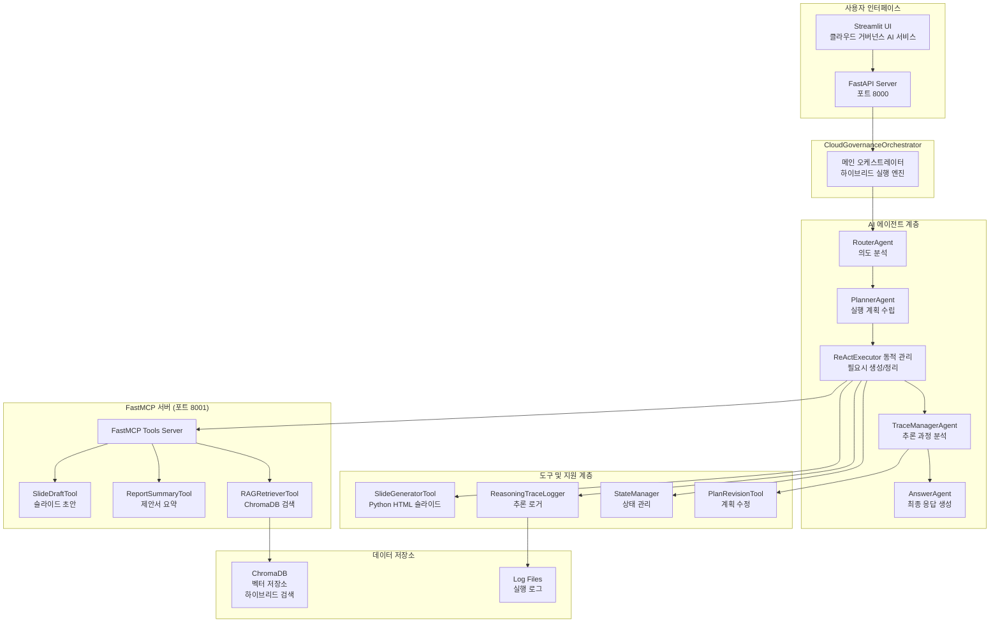
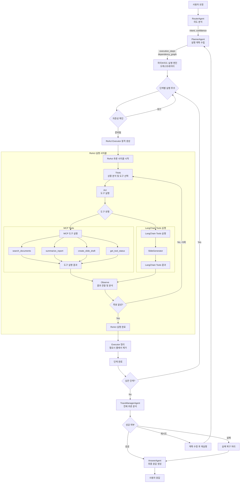
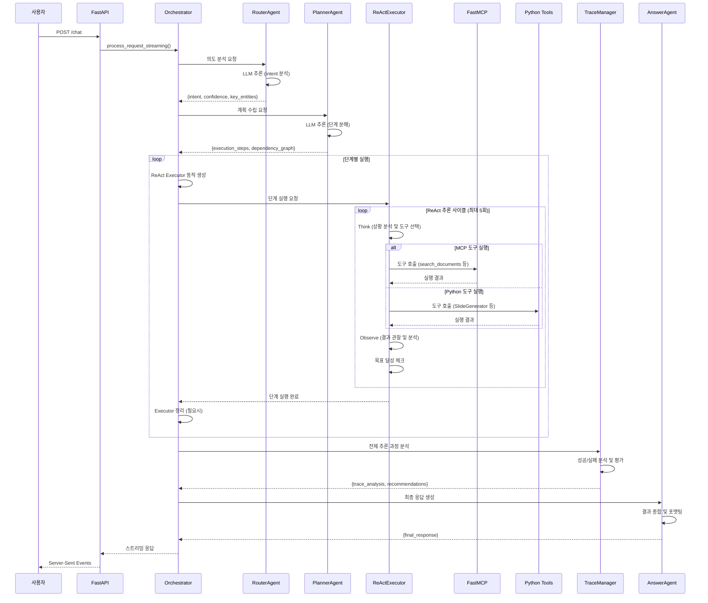

# CloudRegiX - 클라우드 거버넌스 AI 시스템


## 🌟 프로젝트 개요

**CloudRegiX**는 클라우드 거버넌스를 위한 하이브리드 AI 시스템입니다. Plan & Execute와 ReAct(Reasoning and Acting) 방식을 결합하여 복잡한 클라우드 거버넌스 질문에 답변하고, 프레젠테이션 자료를 생성합니다.

## 🎯 핵심 특징

- **🔄 하이브리드 AI**: Plan & Execute + ReAct 방식 결합
- **🤖 멀티 에이전트**: 5개 전문 에이전트의 협업
- **⚡ 동적 실행**: ReAct Executor를 필요시에만 동적 생성/관리
- **🛡️ 자동 복구**: 실패 상황 감지 및 복구
- **📊 실시간 추적**: 전체 추론 과정 로깅 및 분석
- **🔗 MCP 프로토콜**: FastMCP 기반 도구 통합

## 📁 프로젝트 구조

```
CloudRegiX/
├── agents/                     # AI 에이전트 모음
│   ├── router_agent.py         # 사용자 의도 분석
│   ├── planner_agent.py        # 실행 계획 수립
│   ├── react_executor_agent.py # ReAct 방식 실행
│   ├── trace_manager_agent.py  # 추론 과정 분석
│   └── answer_agent.py         # 최종 응답 생성
├── core/                       # 기본 클래스 및 설정
│   ├── base_agent.py          # 에이전트 기본 클래스
│   ├── base_tool.py           # 도구 기본 클래스
│   ├── settings.py            # 시스템 설정
│   ├── search_engine.py       # 검색 엔진 코어
│   ├── stream_agent.py        # 스트리밍 에이전트
│   └── standalone_vectorization.py # 독립 벡터화
├── tools/                      # 시스템 도구 모음
│   ├── state_manager.py       # 상태 관리
│   ├── reasoning_trace_logger.py # 추론 로거
│   ├── plan_revision_tool.py  # 계획 수정
│   ├── rag_retriever.py       # RAG 기반 정보 검색
│   ├── report_summary.py      # 보고서 생성 및 요약
│   ├── slide_generator.py     # LangChain 슬라이드 생성
│   └── slide_draft.py         # MCP 슬라이드 초안
├── streamlit/                  # 웹 UI
│   └── main.py                # Streamlit 앱
├── data/                       # 데이터 저장소
│   └── vectorstore/           # ChromaDB 벡터 저장소
├── docs/                       # 기술 문서
│   ├── api_server_analysis.md
│   └── mcp_server_analysis.md
├── orchestrator.py            # 메인 오케스트레이터
├── api_server.py              # FastAPI 서버
├── mcp_server.py              # FastMCP 서버
├── mcp_client.py              # MCP 클라이언트
├── start_servers.py           # 서버 통합 실행
└── requirements.txt           # 종속성
```

### 폴더별 역할

#### 📂 `agents/` - AI 에이전트

- **RouterAgent**: 사용자 의도 분석 및 분류 (question/slide_generation/general)
- **PlannerAgent**: 하이브리드 실행 계획 수립 및 단계 분해
- **ReActExecutorAgent**: ReAct 방식으로 개별 단계 실행 (풀링 방식 관리)
- **TraceManagerAgent**: 전체 실행 과정 추론 분석 및 평가
- **AnswerAgent**: 최종 사용자 응답 생성 및 포맷팅

#### 📂 `core/` - 기본 구조

- **BaseAgent**: 모든 에이전트의 추상 기본 클래스
- **BaseTool**: 도구들의 기본 인터페이스
- **settings**: Azure OpenAI 및 Claude LLM, 임베딩 설정 관리
- **search_engine**: ChromaDB 기반 검색 엔진
- **stream_agent**: 스트리밍 응답 처리

#### 📂 `tools/` - 지원 도구

- **StateManager**: 시스템 상태 추적 및 관리
- **ReasoningTraceLogger**: 추론 과정 로깅
- **PlanRevisionTool**: 실행 계획 동적 수정
- **RAGRetriever**: ChromaDB 기반 하이브리드 문서 검색
- **ReportSummary**: 클라우드 전환 제안서 생성 및 요약
- **SlideDraft**: MCP 도구 기반 슬라이드 초안 생성
- **SlideGenerator**: Python 도구 기반 HTML 슬라이드 생성

#### 📂 `streamlit/` - 웹 인터페이스

- 클라우드 거버넌스 AI 서비스 단일 페이지 웹 앱
- 실시간 스트리밍으로 질문 답변 및 슬라이드 생성
- API 서버와 연동하여 원활한 사용자 경험 제공

## 🤖 에이전트 아키텍처

### 전체 시스템 구조



### 하이브리드 처리 흐름



### 에이전트 상세 흐름



### 핵심 컴포넌트 상세

#### 🎯 **RouterAgent** - 의도 분석

- **기능**: 사용자 입력 분석 및 의도 분류
- **분류 유형**: `question`, `slide_generation`, `general`
- **출력**: intent, confidence, key_entities, analysis
- **LLM 사용**: JSON 형식 구조화 응답

#### 📋 **PlannerAgent** - 실행 계획 수립

- **기능**: 의도별 최적화된 실행 단계 생성
- **주요 출력**: execution_steps, dependency_graph
- **의존성 관리**: 단계 간 실행 순서 및 병렬 실행 그룹 결정
- **전략 수립**: 하이브리드 실행 방식 결정

#### ⚡ **ReActExecutorAgent** - 추론 실행기

- **실행 방식**: Thought → Action → Observation 순환
- **최대 반복**: 5회까지 목표 달성 시도
- **동적 관리**: 필요시에만 생성하여 사용하는 방식 (최대 5개까지 풀 유지)
- **사용 조건**: 모든 단계 실행 (MCP 도구 및 Python 도구 통합 처리)
- **도구 연동**: MCP 도구 및 Python 도구 통합 사용
- **상태 추적**: 각 단계별 추론 과정 로깅

#### 📊 **TraceManagerAgent** - 추론 분석

- **기능**: 전체 실행 과정 품질 분석
- **분석 대상**: execution_results, failed_steps, context
- **출력**: trace_analysis, final_assessment, recommendations
- **복구 지원**: 실패 지점 식별 및 복구 전략 제안

#### 💬 **AnswerAgent** - 최종 응답 생성

- **기능**: 실행 결과를 사용자 친화적 형태로 변환
- **입력 통합**: execution_results, trace_analysis, context
- **출력 형식**: 마크다운 기반 구조화된 응답
- **슬라이드 처리**: HTML 슬라이드 데이터 포함

### 🔧 지원 도구 시스템

#### **StateManager** - 상태 관리

- **기능**: Agent 간 상태 동기화 및 의존성 관리
- **관리 대상**: agent_states, shared_data, dependencies
- **동작**: set_state, get_state, check_dependency, complete_execution

#### **ReasoningTraceLogger** - 추론 로깅

- **기능**: 전체 추론 과정 기록 및 분석
- **수집 데이터**: thought, observation, action, metadata
- **추적 범위**: 개별 Agent 및 글로벌 워크플로우

#### **PlanRevisionTool** - 계획 수정

- **기능**: 실패한 단계에 대한 대안 계획 생성
- **동작**: 복구 단계 추가, 도구 대체, 실행 이력 관리

#### **SlideGeneratorTool** - Python 기반 슬라이드 생성기

- **기능**: 마크다운 슬라이드 초안을 HTML 프레젠테이션으로 변환
- **입력**: slide_draft, search_results, user_input
- **출력**: 완성된 HTML 슬라이드 및 메타데이터
- **특징**: SlideDraft 도구의 결과를 받아 최종 HTML 슬라이드 생성

#### **SlideDraftTool** - MCP 기반 슬라이드 초안 생성기

- **기능**: RAG 검색 결과 기반 슬라이드 초안 생성
- **구성**: 5개 슬라이드로 구성된 마크다운 초안
- **후처리**: SlideGeneratorTool로 HTML 변환 가능

### 🛠️ FastMCP 도구 서버

#### **RAGRetrieverTool** (search_documents)

- **기능**: ChromaDB 기반 하이브리드 문서 검색
- **검색 방식**: 벡터 + 키워드 + 적응형 선택
- **출력**: 검색 결과 리스트 및 관련성 점수

#### **ReportSummaryTool** (summarize_report)

- **기능**: 클라우드 전환 제안서 구조화 요약
- **구조**: 14개 섹션 (개요, 필요성, 전략, 로드맵 등)
- **출력**: HTML 형식 구조화된 제안서

#### **SlideDraftTool** (create_slide_draft)

- **기능**: RAG 검색 결과 기반 슬라이드 초안 생성
- **구성**: 5개 슬라이드로 구성된 마크다운 초안
- **후처리**: SlideGeneratorTool로 HTML 변환

## 🚀 시작하기

### 필요 조건

```bash
Python 3.12+
```

### 설치 및 실행

```bash
# 저장소 클론
git clone <repository-url>
cd CloudRegiX

# 종속성 설치
pip install -r requirements.txt

# 환경 변수 설정 (.env 파일 생성)
AOAI_API_KEY=your_azure_openai_api_key
AOAI_ENDPOINT=your_azure_openai_endpoint
AOAI_API_VERSION=2024-10-01-preview
ANTHROPIC_API_KEY=your_anthropic_api_key

# 1. 백엔드 서버 시작 (필수)
python start_servers.py

# 2. 웹 UI 시작 (별도 터미널에서)
cd streamlit
python run_streamlit.py

# 또는 개별 실행
python api_server.py              # FastAPI 서버 (8000번 포트)
python mcp_server.py              # FastMCP 서버 (8001번 포트)
streamlit run streamlit/main.py   # Streamlit UI (8501번 포트)
```

## 🔧 사용법

### 웹 UI

1. 브라우저에서 `http://localhost:8501` 접속
2. **클라우드 거버넌스 AI 서비스**: 통합 질의응답 및 슬라이드 생성 서비스
   - 슬라이드 생성: "슬라이드 만들어줘", "프레젠테이션 자료" 등의 요청
   - 일반 질문: 클라우드 거버넌스 관련 질의응답
   - 실시간 진행 상황 표시 및 스트리밍 응답
   - 완성된 슬라이드 미리보기 및 다운로드 기능

### REST API

```bash
curl -X POST "http://localhost:8000/chat" \
  -H "Content-Type: application/json" \
  -d '{"query": "클라우드 보안 정책에 대해 설명해주세요"}'
```

### 직접 API 호출

```python
from orchestrator import CloudGovernanceOrchestrator

orchestrator = CloudGovernanceOrchestrator()
result = orchestrator.process_request_streaming("클라우드 거버넌스 슬라이드를 만들어주세요")
for chunk in result:
    print(chunk)
```

## 🧪 테스트

```bash
# LLM 연결 테스트
python test_llm_direct.py

# 벡터 데이터베이스 독립 실행
python core/standalone_vectorization.py
```

## 🛠️ 기술 스택

- **AI Framework**: LangChain, OpenAI GPT-4o, Claude Sonnet-4
- **벡터 검색**: ChromaDB (하이브리드 검색 지원)
- **웹 Framework**: FastAPI, Streamlit
- **프로토콜**: FastMCP (Model Context Protocol)
- **임베딩**: Azure OpenAI text-embedding-3-small (1536차원)
- **언어**: Python 3.12+

## 📊 주요 기능

### 지원하는 요청 유형

1. **질문 답변**: 클라우드 거버넌스 관련 질문
2. **슬라이드 생성**: HTML 형식의 프레젠테이션 자료 생성
3. **일반 대화**: 기본적인 상호작용

### 처리 성능

- **평균 응답 시간**: 3-20초 (복잡도에 따라)
- **하이브리드 실행**: 모든 실행이 ReAct Executor를 통해 처리 (MCP 도구 + Python 도구 통합)
- **동적 관리**: ReAct Executor를 필요시에만 동적 생성/정리 (최대 5개까지 풀 유지)
- **자동 복구**: 실패 시 최대 5회 재시도
- **벡터 검색**: ChromaDB 기반 하이브리드 검색

## 📝 라이선스

MIT 라이선스

## 🤝 기여하기

1. Fork the Project
2. Create your Feature Branch (`git checkout -b feature/AmazingFeature`)
3. Commit your Changes (`git commit -m 'Add some AmazingFeature'`)
4. Push to the Branch (`git push origin feature/AmazingFeature`)
5. Open a Pull Request

---

_CloudRegiX - 클라우드 거버넌스를 위한 지능형 AI 시스템_ 🚀
