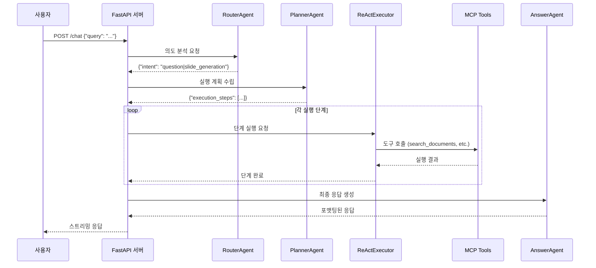
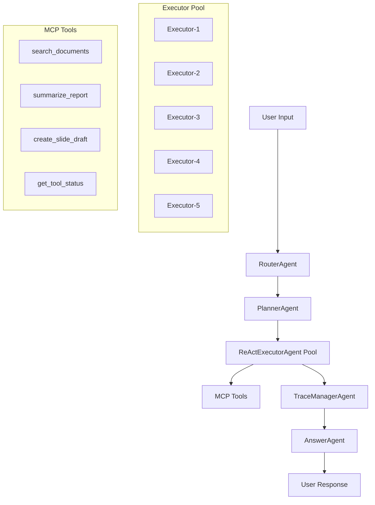
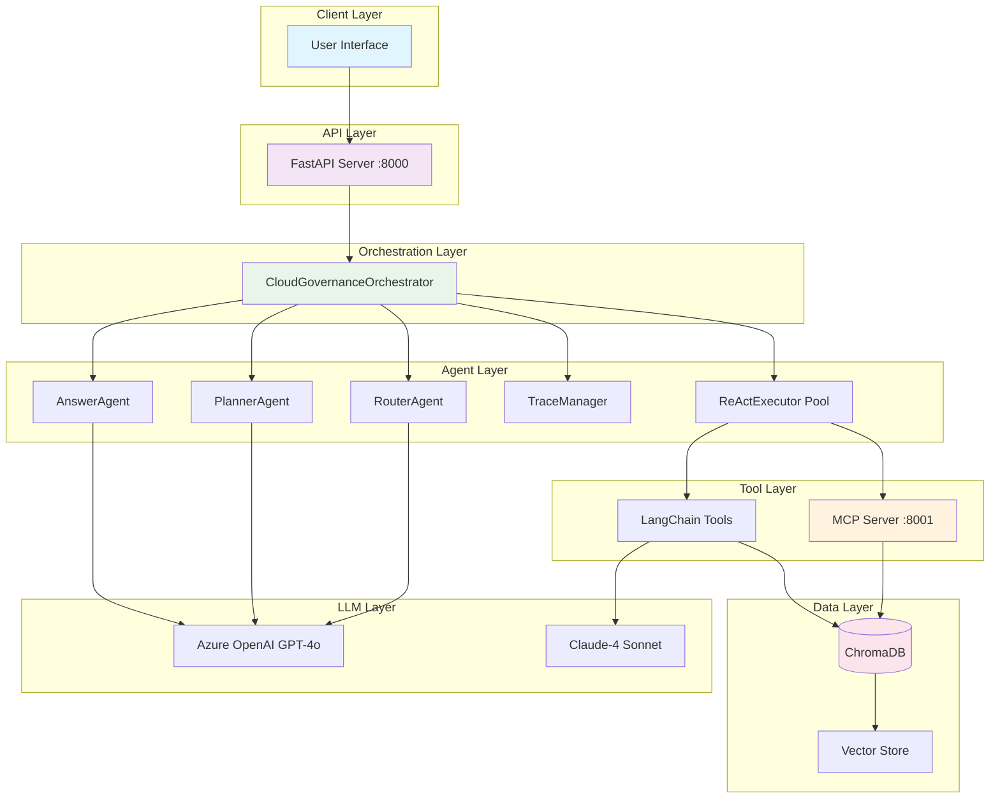

# 📘 클라우드 거버넌스 AI Agent API 구조 분석

## 1. 🧩 서비스 개요

### 서비스 목적

이 서비스는 **클라우드 거버넌스 전문 AI 어시스턴트**로, 사용자의 질문에 대해 답변을 제공하고 클라우드 전환 관련 프레젠테이션 슬라이드를 자동 생성하는 기능을 제공합니다.

### 주요 기능

- **Q&A 서비스**: 클라우드 거버넌스 관련 전문 질문 답변
- **슬라이드 생성**: 클라우드 전환 제안서 및 프레젠테이션 자료 자동 생성
- **RAG 기반 검색**: ChromaDB를 활용한 문서 검색 및 정보 제공
- **스트리밍 응답**: 실시간 응답 제공으로 사용자 경험 향상

### 사용자 요청/응답 형태

- **입력**: 자연어 텍스트 (질문 또는 슬라이드 생성 요청)
- **출력**: 스트리밍 JSON 형태의 답변 또는 HTML 슬라이드

---

## 2. 🔁 전체 서비스 흐름도

### 요청 처리 단계

1. **사용자 입력 수신** → FastAPI 엔드포인트 `/chat`
2. **의도 분석** → RouterAgent를 통한 Intent 추출
3. **실행 계획 수립** → PlannerAgent를 통한 하이브리드 실행 계획
4. **단계별 실행** → ReActExecutorAgent + MCP Tools를 통한 작업 수행
5. **추적 및 관리** → TraceManagerAgent를 통한 실행 과정 모니터링
6. **최종 응답 생성** → AnswerAgent를 통한 사용자 친화적 응답 포맷팅

### 시퀀스 다이어그램



---

## 3. 🧠 AI Agent 구조

### Agent 목록 및 역할

#### 1. **RouterAgent**

- **역할**: 사용자 입력 분석 및 의도(Intent) 추출
- **사용 도구**: LLM (GPT-4o 또는 Claude-4)
- **처리 방식**: 사용자 입력을 분석하여 `question`, `slide_generation`, `general` 중 하나로 분류
- **출력**: `{"intent": "...", "confidence": 0.8, "key_entities": [...]}`

#### 2. **PlannerAgent**

- **역할**: Router 결과를 바탕으로 하이브리드 실행 계획 수립
- **사용 도구**: LLM + PlanRevisionTool
- **처리 방식**: 의도별로 최적화된 실행 단계와 의존성 그래프 생성
- **출력**: 실행 단계 리스트 및 의존성 그래프

#### 3. **ReActExecutorAgent**

- **역할**: Thought → Action → Observation 패턴으로 개별 계획 단계 실행
- **사용 도구**: MCP Tools (search_documents, summarize_report 등)
- **처리 방식**: 최대 5회 반복을 통한 목표 달성
- **특징**: 풀링 방식으로 최대 5개 인스턴스 동시 실행 가능

#### 4. **TraceManagerAgent**

- **역할**: 전체 추론 과정 기록 및 실패 지점 분석
- **사용 도구**: ReasoningTraceLogger, StateManager
- **처리 방식**: 실행 과정 모니터링 및 성능 메트릭 수집
- **출력**: 실행 품질 분석 및 재시도 권장사항

#### 5. **AnswerAgent**

- **역할**: 최종 사용자 응답 포맷팅 및 생성
- **사용 도구**: LLM
- **처리 방식**: 실행 결과를 사용자 친화적인 형태로 변환
- **출력**: 마크다운 형식의 완성된 답변

### Agent 연결 구조



---

## 4. 🛠️ 참조되는 파일 / 모듈 설명

### 핵심 모듈

#### **orchestrator.py** - 하이브리드 오케스트레이터

```python
class CloudGovernanceOrchestrator:
    - process_request_streaming(): 스트리밍 요청 처리
    - _execute_step_streaming(): 단계별 스트리밍 실행
    - _execute_single_step(): 개별 단계 실행 (MCP 도구 호출)
```

#### **core/settings.py** - LLM 및 설정 관리

```python
- get_llm(): Azure OpenAI GPT-4o 인스턴스 반환
- get_claude_llm(): Claude-4 Sonnet 인스턴스 반환
- get_embeddings(): Azure OpenAI Embeddings 반환
```

#### **mcp_client.py** - MCP 프로토콜 클라이언트

```python
class SyncMCPClient:
    - search_documents(): RAG 기반 문서 검색
    - summarize_report(): 클라우드 전환 제안서 요약
    - create_slide_draft(): 슬라이드 초안 생성
```

#### **mcp_server.py** - MCP 도구 서버

- FastMCP 기반 도구 서버
- RAG, 보고서 요약, 슬라이드 초안 도구 제공
- 포트 8001에서 HTTP 프로토콜로 서비스

### Tools 디렉토리

#### **RAG 검색 도구**

- **rag_retriever.py**: ChromaDB 기반 하이브리드 검색 (벡터 + 키워드)
- **search_engine.py**: 검색 엔진 코어 로직

#### **슬라이드 생성 도구**

- **slide_generator.py**: LangChain Tool 기반 최종 HTML 슬라이드 생성
- **slide_draft.py**: MCP Tool 기반 슬라이드 초안 생성

#### **보고서 처리 도구**

- **report_summary.py**: 클라우드 전환 제안서 구조에 맞는 요약 생성

#### **상태 관리 도구**

- **state_manager.py**: Agent 간 상태 동기화 및 의존성 관리
- **reasoning_trace_logger.py**: 추론 과정 기록 및 분석
- **plan_revision_tool.py**: 실행 계획 수정 및 재시도 로직

---

## 5. 🧪 주요 엔드포인트 설명

### **POST /chat** - 통합 질문 답변 및 슬라이드 생성

- **HTTP 메서드**: POST
- **경로**: `/chat`
- **요청 형식**:

```json
{
  "query": "클라우드 거버넌스에 대해 설명해주세요",
  "options": {}
}
```

- **응답 형식**: Server-Sent Events (SSE) 스트리밍

```
data: {"type": "progress", "stage": "router_analysis", "message": "...", "progress": 0.1}
data: {"type": "tool_execution", "stage": "...", "message": "...", "chunk_data": {...}}
data: {"type": "stream_end", "message": "처리가 완료되었습니다."}
```

- **내부 처리 흐름**:
  1. RouterAgent를 통한 의도 분석
  2. PlannerAgent를 통한 실행 계획 수립
  3. CloudGovernanceOrchestrator의 하이브리드 스트리밍 실행
  4. 단계별 진행 상황을 실시간 스트리밍

### **GET /health** - 헬스 체크

- **HTTP 메서드**: GET
- **경로**: `/health`
- **응답 형식**:

```json
{
    "status": "healthy",
    "system_status": {...},
    "timestamp": "2024-01-01T00:00:00"
}
```

### **GET /system/status** - 시스템 상태 조회

- **HTTP 메서드**: GET
- **경로**: `/system/status`
- **응답 형식**:

```json
{
  "success": true,
  "data": {
    "agents_status": "initialized",
    "mcp_tools_status": "available",
    "langchain_tools_status": "available"
  }
}
```

### **GET /** - 루트 엔드포인트

- **HTTP 메서드**: GET
- **경로**: `/`
- **응답**: 서비스 기본 정보

---

## 6. ⚙️ 실행 및 배포 정보

### 개발 환경 실행

```bash
# 단일 API 서버 실행
python api_server.py

# 또는 전체 서버 실행 (API + MCP)
python start_servers.py
```

### 서버 구성

- **API 서버**: `0.0.0.0:8000` (uvicorn)
- **MCP 서버**: `localhost:8001` (FastMCP)
- **리로드 모드**: 개발시 활성화 (`reload=True`)
- **로그 설정**: `log/` 디렉토리에 서버별 로그 파일 생성

### 환경 변수 설정 (.env)

```env
AOAI_API_KEY=your_azure_openai_key
AOAI_ENDPOINT=https://your-endpoint.openai.azure.com/
AOAI_API_VERSION=2024-02-15-preview
ANTHROPIC_API_KEY=your_anthropic_key
```

### 주요 의존성

```
- fastapi==0.115.12: API 서버 프레임워크
- langchain==0.3.25: LLM 통합 프레임워크
- langchain-anthropic==0.3.17: Claude-4 연동
- langchain-openai==0.3.21: Azure OpenAI 연동
- fastmcp==2.8.1: MCP 서버 프레임워크
- chromadb==1.0.13: 벡터 데이터베이스
- streamlit==1.45.1: 웹 UI (선택사항)
```

### 배포 고려사항

- **Docker**: 현재 미구성 (수동 설치 필요)
- **스케일링**: ReActExecutor 풀 크기 조정 가능 (기본 5개)
- **로그 관리**: 파일 기반 로깅, 로테이션 미구성
- **보안**: CORS 전체 허용 상태 (프로덕션에서 제한 필요)

---

## 7. 📎 부록

### 핵심 설정 파일 구성 예시

#### **.env 파일**

```env
# Azure OpenAI 설정
AOAI_API_KEY=your_azure_openai_api_key
AOAI_ENDPOINT=https://your-resource.openai.azure.com/
AOAI_API_VERSION=2024-02-15-preview

# Anthropic Claude 설정
ANTHROPIC_API_KEY=your_anthropic_api_key
```

#### **MCP 도구 설정**

- **URL**: `http://localhost:8001/tools`
- **프로토콜**: streamable_http
- **도구 목록**:
  - `search_documents`: RAG 기반 문서 검색
  - `summarize_report`: 클라우드 전환 제안서 요약
  - `create_slide_draft`: 슬라이드 초안 생성
  - `get_tool_status`: MCP 서버 상태 확인

### LLM 모델 설정

#### **Azure OpenAI**

- **모델**: gpt-4o
- **임베딩**: text-embedding-3-small (1536차원)
- **스트리밍**: 활성화
- **Temperature**: 0.7

#### **Anthropic Claude**

- **모델**: claude-sonnet-4-20250514
- **최대 토큰**: 10,000
- **스트리밍**: 활성화
- **Temperature**: 0.7

### 데이터베이스 구성

- **벡터DB**: ChromaDB (로컬 파일)
- **위치**: `data/vectorstore/`
- **컬렉션**: `cloudregix_documents`
- **검색 방식**: 하이브리드 (벡터 + 키워드)

### 성능 최적화 설정

- **ReAct Executor 풀**: 최대 5개 동시 실행
- **MCP 연결**: 비동기 처리
- **스트리밍**: 청크 단위 실시간 응답
- **캐싱**: RAG 검색 결과 메모리 캐싱

---

## 📊 시스템 아키텍처 다이어그램



이 문서는 클라우드 거버넌스 AI Agent API의 전체 구조와 동작 방식을 종합적으로 분석한 기술 문서입니다.
